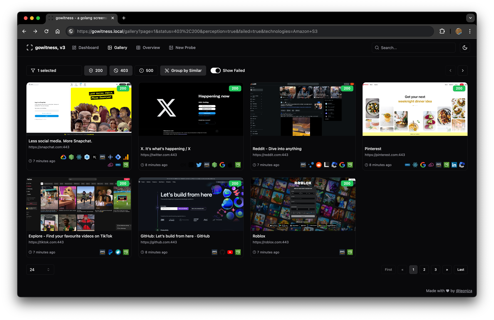
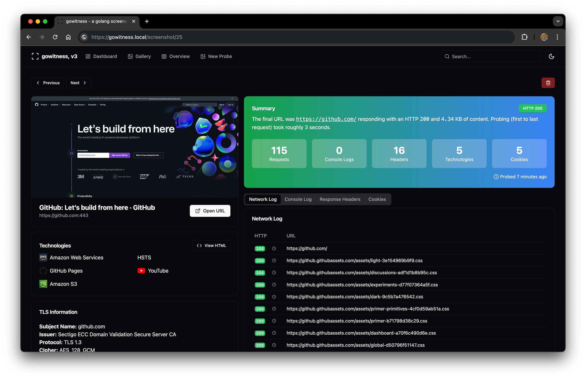
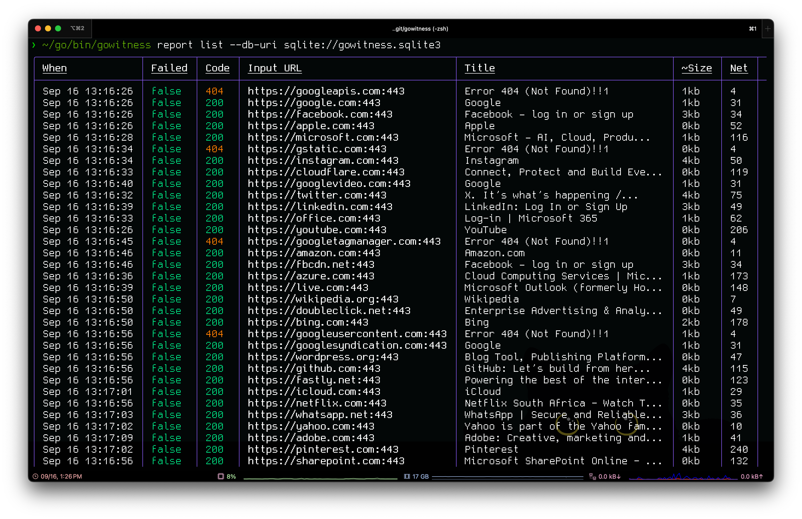

# Gowitness

> **Illumi 打造的網站截圖工具，採用 Chrome Headless。**

[](https://x.com/sakumaillumi)
[](https://goreportcard.com/report/github.com/sensepost/gowitness)
[](https://github.com/IllumiLove/Gowitness/actions)

---

## 介紹

**gowitness** 是一款以 Golang 撰寫的網站截圖 CLI 工具，內部透過 **Chrome Headless** 擷取網頁畫面，並附帶圖形化報表檢視器。
目前支援 **Linux／macOS**；Windows 也大致可用。

---

## 特色

| 功能                     | 說明                                               |
| :--------------------- | :----------------------------------------------- |
| 🔍 **快速、精準截圖**         | 核心任務就是把網站畫面抓下來──而且又快又準！                          |
| 📜 **多種來源掃描**          | 支援 URL 清單、CIDR、Nmap 結果、Nessus 報告……等。             |
| 📦 **同步收集請求資訊**        | 例如 request log、console log、HTTP header、cookie 等。 |
| 💾 **多格式輸出**           | SQLite DB、JSON Lines、CSV… 想怎麼存就怎麼存。              |
| 🖥️ **內建 Web 檢視器/API** | 若寫入 SQLite，可直接用瀏覽器瀏覽結果、呼叫 API。                   |
| ⚙️ **彈性 CLI 旗標**       | 子命令、旗標眾多，加 `-h` 就能查看完整說明。                        |

---

## 快速上手

1. **Go 18+** 環境下可直接安裝：

   ```bash
   go install github.com/sensepost/gowitness@latest
   ```

2. 或者到 Release 區下載二進位檔／自行編譯。

3. 初次掃描範例（將截圖存到 `./screenshots`，同時把結果寫入 SQLite）：

   ```bash
   gowitness scan single \
     --url "https://sensepost.com" \
     --write-db
   ```

---

## 文件

進階安裝與完整使用手冊請見 Wiki：[https://github.com/sensepost/gowitness/wiki](https://github.com/sensepost/gowitness/wiki)

---

## 截圖預覽

|                   圖庫檢視                   |                  詳細檢視                  |                    終端輸出                    |
| :--------------------------------------: | :------------------------------------: | :----------------------------------------: |
|  |  |  |

---

## 鳴謝

本專案大量受惠於以下開源計畫（節錄）：chi、chromedp、go-rod、cobra、gorm、glamour、go-nmap、wappalyzergo、goimagehash ……詳見 `go.mod`。

---

## 授權

gowitness 以 **GNU GPL v3** 授權發佈。若需超出 GPL 範圍的商業使用，請洽 [http://sensepost.com/contact/](http://sensepost.com/contact/) 。

---

